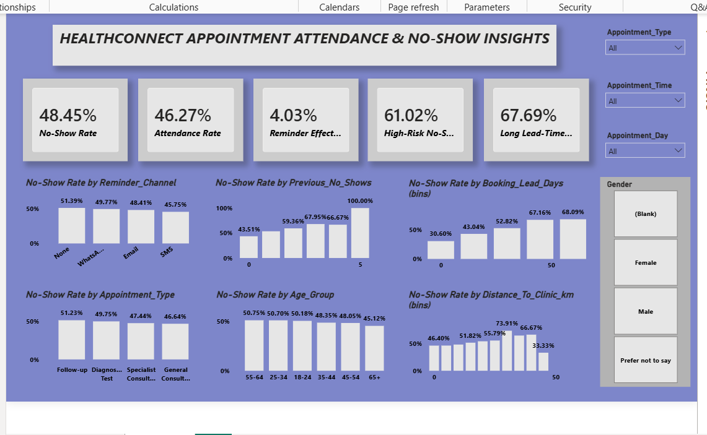

# HealthConnect — Week 8: Final Integration, Decision Support & Project Showcase

## Overview

Week 8 marked the final stage of the HealthConnect Experience Lab.

Building on the analysis, advanced analytics, testing, and validation completed in Weeks 5–7, this stage focused on final integration, decision support, documentation, and communicating the project outcome.

The Data Analytics track focused on presenting validated findings, confirming final KPIs, connecting analytical insights with the wider HealthConnect solution, and translating the results into actionable business recommendations.

---

## Project Problem

HealthConnect aims to improve patient appointment attendance and healthcare support by using data and AI to better understand missed appointments.

The Data Analytics contribution focused on identifying patterns associated with appointment no-shows and translating those patterns into evidence that could support better decisions.

---

## Analytics Journey

The project progressed through four main stages:

**Week 5 — Analysis & Dashboard Development**
- Explored the HealthConnect appointment dataset.
- Performed data quality checks and exploratory analysis.
- Identified key patterns associated with no-shows.
- Developed the initial Power BI dashboard.

**Week 6 — Advanced Analytics & Decision Support**
- Investigated relationships between important risk indicators.
- Analysed previous no-shows against reminder status.
- Analysed booking lead time against previous no-shows.
- Investigated distance, previous no-shows and reminder status.
- Translated findings into potential business actions.

**Week 7 — Testing & Validation**
- Independently validated the main KPIs.
- Tested analytical findings against the underlying data.
- Tested dashboard slicers and calculations.
- Refined the interpretation of distance as a supporting indicator.
- Cross-validated analytical findings with the Data Science track.

**Week 8 — Final Integration & Presentation**
- Confirmed final analytics findings and KPIs.
- Consolidated the Analytics contribution.
- Connected analytical findings with the wider HealthConnect solution.
- Finalized business insights and recommendations.
- Prepared the analytics contribution for the final project presentation.

---

## Final KPIs

| KPI | Final Result |
|---|---:|
| No-Show Rate | 48.45% |
| Attendance Rate | 46.27% |
| Reminder Effectiveness | 4.03% |
| High-Risk No-Show Rate (2+ previous no-shows) | 61.02% |
| Long Lead-Time No-Show Rate (>45 days) | 68.09% |

---

## Key Validated Findings

### 1. Previous No-Shows

No-show rates generally increased as the number of previous no-shows increased.

| Previous No-Shows | No-Show Rate |
|---:|---:|
| 0 | 43.51% |
| 1 | 53.49% |
| 2 | 59.36% |
| 3 | 67.95% |
| 4 | 66.67% |
| 5 | 100% |

This identified previous attendance behaviour as an important indicator for attendance-support strategies.

### 2. Booking Lead Time

Longer booking lead times were associated with higher no-show rates.

The total no-show rate across the analysed lead-time bands increased from approximately **30.60% to 68.09%**.

This suggested that appointments booked far in advance may benefit from additional engagement closer to the appointment date.

### 3. Reminder Activity

Patients who received reminders had a lower observed no-show rate overall than patients who did not receive reminders.

This finding was treated as an association rather than evidence of causation.

### 4. Distance

Distance provided additional context around appointment attendance.

Higher-distance groups showed greater variability, particularly at the upper end of the distance range.

For this reason, distance was retained as a **supporting indicator rather than a primary risk factor**.

---

## Cross-Track Collaboration

### Data Analytics → Data Science

The Analytics track shared the booking lead-time findings with Data Science for modelling consideration.

Data Science compared:

- Raw booking lead days
- Raw booking lead days + lead-time bands
- Lead-time bands alone

Cross-validation showed that the lead-time bands did not meaningfully improve model accuracy or ROC-AUC compared with raw booking lead days.

The decision was therefore to:

- Retain the lead-time bands for **stakeholder interpretation and storytelling**
- Retain raw booking lead days for **predictive modelling**

This demonstrated the difference between a feature being useful for explaining a business problem and actually improving predictive performance.

---

## Business Insights

The final analysis highlighted several areas for decision support:

- Patients with previous no-shows represent an important group for targeted attendance support.
- Longer booking lead times are associated with higher observed no-show rates.
- Reminder activity provides a potential intervention point.
- Distance can provide additional context when investigating attendance barriers.
- Descriptive insights and predictive modelling features should not automatically be treated as the same thing.

---

## Recommendations

1. Develop targeted attendance-support strategies for patients with previous no-shows.
2. Consider additional confirmation or reminder activity for appointments booked far in advance.
3. Continue evaluating reminder processes, particularly for higher-risk groups.
4. Investigate accessibility barriers and rescheduling support for patients travelling longer distances.
5. Use lead-time bands for stakeholder communication while retaining raw booking lead days for predictive modelling.

---

## Final Dashboard & Analytics

The final Analytics contribution builds on the existing Week 5 Power BI dashboard and Week 6 advanced analytical page rather than creating an unrelated new dashboard.

### Week 5 Dashboard

### Week 6 Advanced Analytics

---

## Limitations

- The analysis identifies associations rather than causation.
- Some high-distance and high previous-no-show segments have relatively small sample sizes.
- Lead-time bands improved interpretation but did not improve predictive model performance.
- Findings should continue to be monitored as new appointment data becomes available.
- Further validation would be required before operational deployment.

---

## Final Outcome

The Data Analytics track progressed from exploratory analysis to advanced investigation, testing, cross-track validation, and final decision support.

The final Analytics component provides a validated evidence base for understanding appointment no-shows and identifying areas where attendance-support strategies could be focused.

One of the key lessons from the project was that **a finding can be valuable for explaining a business problem without necessarily improving predictive performance**.

---

## Tools Used

- Microsoft Excel
- Power Query
- Power BI
- DAX
- Data Analysis
- Data Visualization
- Cross-functional collaboration

---

## Project Progression

**Problem Understanding → Data Analysis → Dashboard → Advanced Analytics → Testing & Validation → Cross-Track Integration → Final Decision Support**

---

## Project Status

**Final Analytics Component: Completed and validated**

The HealthConnect project demonstrates how data analysis can move beyond reporting to support evidence-based decision-making while maintaining transparency around analytical and modelling limitations.
